<div align="center">
  
  <p>
    
    
    
  </p>
</div>

# RL Portfolio Trading

Dự án nghiên cứu **reinforcement-learning-based portfolio trading** trên 16 cổ phiếu Việt Nam. Agent không dự đoán trực tiếp giá hoặc tín hiệu; agent học chính sách phân bổ/giao dịch danh mục từ chuỗi đặc trưng thị trường và trạng thái tài khoản, sau đó được đánh giá bằng daily backtest có phí giao dịch.

> Chỉ phục vụ nghiên cứu và giáo dục. Không phải khuyến nghị đầu tư.

## Overview

Repository triển khai ba hướng tiếp cận bằng PyTorch trên một môi trường `Gymnasium` dùng chung:

- **PPO-LSTM**: policy liên tục sinh tỷ trọng mục tiêu cho 16 cổ phiếu và tiền mặt.
- **DDQ-LSTM**: Double DQN với một quyết định `sell` / `hold` / `buy` cho một mã tại mỗi bước.
- **Branching DDQ-LSTM**: Double DQN đa nhánh, sinh một quyết định rời rạc cho từng mã trong cùng bước.

Đây là bài toán **multi-asset portfolio allocation and execution**. Mục tiêu học là tối đa hóa discounted reward gắn với excess return và rủi ro danh mục, không phải tối thiểu hóa sai số dự báo giá.

## Problem Definition

Tại ngày giao dịch `t`, agent quan sát cửa sổ lịch sử đến hết giá đóng cửa ngày `t` và trạng thái danh mục hiện tại. Quyết định được khớp ở giá mở cửa ngày `t + 1`; danh mục được định giá và reward được tính ở giá đóng cửa ngày `t + 1`.

| Thành phần | Implementation hiện tại |
|---|---|
| Universe | 16 cổ phiếu Việt Nam: `ACB`, `BID`, `BVH`, `CTG`, `FPT`, `GAS`, `HPG`, `MBB`, `MSN`, `MWG`, `SHB`, `SSI`, `STB`, `VCB`, `VIC`, `VNM` |
| Vốn ban đầu | `1,000,000,000` VND, toàn bộ ở tiền mặt |
| Portfolio | Tiền mặt không âm và số cổ phiếu nắm giữ theo từng mã; không short, không margin |
| Position sizing | PPO tái cân bằng theo tỷ trọng; DDQ mua tối đa 20% NAV cho mã được chọn; Branching DDQ chia tiền khả dụng giữa các mã mua và giới hạn 20% NAV mỗi mã |
| Lot size | Bội số 100 cổ phiếu |
| Transaction cost | `0.1%` giá trị mỗi lệnh theo các config train hiện tại |
| Execution | Bán trước, mua sau; tiền bán có thể dùng ngay trong cùng step |
| Objective | Tối đa hóa tổng reward đã chiết khấu; reward ưu tiên excess return ổn định và phạt drawdown/turnover tùy config |

Không có position limit tổng quát theo số mã, stop-loss, leverage, VaR limit hoặc sector constraint đang hoạt động. Một hàm giới hạn số vị thế có trong model Branching nhưng không được gọi.

## Dataset

### Nguồn và phạm vi

`src/data/download_data.py` dùng `vnstock.Vnstock().stock(...).quote.history(...)` để tải OHLCV. Entry point hiện cấu hình:

- source: `VCI`;
- interval: `1D`;
- requested range: `2015-01-01` đến `2025-12-31`;
- universe tải: 30 mã trong `ALL_TICKERS`.

Các CSV raw đang lưu trong repository có phạm vi thực tế khác nhau theo lịch sử niêm yết, từ sớm nhất `2013-09-03` đến `2025-12-31`. Mỗi file có các cột:

```text
time, open, high, low, close, volume, symbol
```

Source provenance không được lưu kèm từng CSV, vì vậy `VCI` là nguồn được cấu hình trong downloader, không phải metadata có thể xác minh độc lập từ file dữ liệu.

### Dữ liệu dùng cho training

Training config chọn 16 mã có lịch sử dài. Repository hiện chứa:

| Location | Nội dung | Trạng thái |
|---|---|---|
| `data/raw/` | 30 file OHLCV ngày | Có trong repository |
| `data/processed/` | 16 file, 7 feature; 2,740 ngày chung từ `2015-01-05` đến `2025-12-31` | Có trong repository |
| `data/processed/dataset_trading.zip` | Archive của 16 file processed 7 feature | Có trong repository |
| `data/processed_v2/` | Dataset 9 feature mà cả ba config train đang tham chiếu | Chưa có; phải sinh bằng script |

### Cleaning và đồng bộ

`DataProcessor.clean_data()` thực hiện theo thứ tự:

1. kiểm tra đủ `time`, OHLCV;
2. parse và sort `time` tăng dần;
3. loại timestamp trùng;
4. ép OHLCV về numeric;
5. thay volume thiếu bằng `0`;
6. chỉ forward-fill OHLC, không backfill từ tương lai;
7. loại dòng còn thiếu timestamp hoặc OHLC.

Sau feature engineering, pipeline thay `±inf` bằng `NaN`, loại toàn bộ dòng còn thiếu và giữ dữ liệu từ `2015-01-01`. Không tìm thấy bước xử lý outlier riêng.

Khi load nhiều mã, `StateSpace` và `split_by_ratio()` lấy **intersection của timestamp**, nên mọi asset dùng cùng lịch giao dịch. Dữ liệu được chia tuần tự, không shuffle:

```text
70% train → 15% validation → 15% test
```

Với dataset 7 feature đang có, phép chia tạo 1,917 / 411 / 412 ngày. Dataset 9 feature cần được sinh lại trước khi xác định chính xác mốc ngày của run hiện tại; mỗi run lưu split thực tế trong `summary.json`.

## Data Processing & Feature Engineering

```mermaid
flowchart LR
    A[Raw daily OHLCV] --> B[Sort, deduplicate, numeric coercion]
    B --> C[Forward-fill OHLC, drop invalid rows]
    C --> D[Technical and return features]
    D --> E[Rolling 60-day Z-score]
    E --> F[Drop warm-up NaN/Inf]
    F --> G[Intersect dates across 16 tickers]
    G --> H[70/15/15 chronological split]
    H --> I[60-day RL observation window]
    I --> J[Training and backtesting]
```



Các config train hiện tại dùng đúng 9 feature sau:

| Feature | Cách tính trước normalization |
|---|---|
| `close_norm` | Close |
| `return_1d` | `close.pct_change(1)` |
| `return_5d` | `close.pct_change(5)` |
| `return_20d` | `close.pct_change(20)` |
| `macd` | MACD histogram từ EMA 12, EMA 26 và signal EMA 9 |
| `rsi` | RSI 14 ngày |
| `adx` | ADX 14 ngày với Wilder-style exponential smoothing |
| `volume_norm` | Volume |
| `volatility_20d` | Rolling standard deviation 20 ngày của daily return |

Mỗi chuỗi trên được chuẩn hóa độc lập theo từng mã bằng rolling Z-score 60 ngày. Window chỉ dùng dữ liệu quá khứ và hiện tại. State cuối cùng được clip vào `[-5, 5]` trước khi đưa vào agent.

OHLCV gốc vẫn được giữ trong processed CSV: `open` dùng làm giá khớp lệnh, `close` dùng để định giá danh mục. Agent không quan sát trực tiếp toàn bộ OHLCV; observation chỉ chứa danh sách feature trong config.

## Reinforcement Learning Environment

`TradingEnv` kế thừa `gymnasium.Env` và cung cấp một transition model chung cho cả ba agent.

### Observation / State

Với config mặc định hiện tại:

- 60 ngày lịch sử;
- 16 mã;
- 9 feature/mã/ngày;
- 16 holdings ratios và 1 cash ratio.

Kích thước observation phẳng:

```text
60 × 16 × 9 + 17 = 8,657
```

Observation gồm:

1. **Market state**: tensor `(window_size, n_stocks, n_features)`, sau đó flatten cho Gymnasium và reshape thành `(window_size, n_stocks × n_features)` trước LSTM.
2. **Portfolio state**: giá trị từng vị thế chia NAV, nối với cash/NAV ở phần tử cuối.

### Action

#### PPO: continuous allocation

`Box(0, 1, shape=(N + 1,))` biểu diễn tỷ trọng mục tiêu cho `N` cổ phiếu và tiền mặt. Actor dùng phân phối **Dirichlet**, nên action nằm trên simplex và tổng bằng 1. Environment vẫn clip/normalize để bảo vệ boundary.

Config PPO chính áp dụng:

- `trade_deadband = 0.01`: bỏ qua thay đổi tỷ trọng nhỏ hơn 1%;
- `max_weight_change_per_step = 0.15`: giới hạn mức thay đổi tỷ trọng mỗi mã trong một step.

#### DDQ: flat discrete action

`Discrete(3 × N)`; với 16 mã có 48 action. Một scalar action chọn một mã và một trong ba quyết định:

```text
0 = sell all
1 = hold
2 = buy
```

Các mã còn lại mặc định `hold`. Lệnh buy dùng ngân sách tối đa 20% NAV cho mã được chọn.

#### Branching DDQ: multi-discrete action

`MultiDiscrete([3] × N)` sinh một quyết định `sell` / `hold` / `buy` cho từng mã. Nhiều mã có thể được giao dịch trong cùng step; tiền mua được chia đều giữa các nhánh buy, với trần 20% NAV cho mỗi mã.

### Transition và trading mechanics

Mỗi `step()` thực hiện:

1. định giá danh mục cũ tại close ngày `t`;
2. decode action thành số cổ phiếu;
3. làm tròn về lô 100, chặn bán vượt holdings và scale lệnh mua theo cash khả dụng;
4. khớp bán rồi mua tại open ngày `t + 1`, thu phí hai chiều;
5. định giá holdings tại close ngày `t + 1`;
6. tính reward, ghi NAV/cash/holdings/trades/fees và trả observation mới.

Cơ chế này tránh same-bar look-ahead: action không được khớp tại mức giá đóng cửa đã xuất hiện trong observation.

### Reward

Reward so sánh portfolio log return từ sau giao dịch ở open đến close với benchmark một bước gồm equal-weight stocks **và một phần cash**:

```text
excess_return = log(V_close / V_after_trade_open) - log(equal_weight_cash_growth)
turnover      = traded_notional / post_trade_NAV
```

Ba reward implementation có sẵn:

- `advanced`: direct excess return, rolling excess volatility, drawdown và turnover;
- `sharpe`: rolling Sharpe của excess return, direct excess return, drawdown và turnover;
- `sharpe_plus`: bổ sung holding bonus, momentum alignment và asymmetric drawdown penalty.

Config chính hiện dùng:

- **PPO**: `advanced`, window 20, `excess_scale=80`, `alpha=0.10`, `beta=0.50`, `gamma=0.01`;
- **DDQ**: `sharpe`, window 30, các scale mặc định của `SharpeRewardFunction`;
- **Branching DDQ**: config khai báo `sharpe`, nhưng pipeline hiện truyền tham số của `advanced`; xem [Known reproducibility issues](#known-reproducibility-issues).

Reward cuối được clip vào `[-5, 5]` và nhân `reward_scaling`.

### Episode

- Training dùng random start có seed.
- PPO giới hạn 378 step/episode; DDQ và Branching DDQ giới hạn 512 step/episode theo config.
- Evaluation bắt đầu tại index sớm nhất đủ observation window và chạy đến hết split, vì `max_steps_eval=9999` được cap theo số ngày khả dụng.
- Episode kết thúc khi hết horizon, hết dữ liệu hoặc NAV không dương.

## RL Algorithms

### PPO-LSTM

Custom PyTorch actor-critic, không gọi Stable-Baselines3 trong training pipeline hiện tại:

- LSTM 2 lớp, hidden size 128, dropout 0.1;
- Dirichlet actor cho allocation simplex;
- critic ước lượng `V(s)`;
- GAE, PPO clipped surrogate, clipped value loss, entropy bonus;
- AdamW, cosine learning-rate schedule;
- 600,000 timesteps, rollout 2,048, batch 256, 10 epoch/update;
- `gamma=0.99`, `gae_lambda=0.95`, `clip_range=0.20`, `target_kl=0.02`.

### DDQ-LSTM

Double Deep Q-Learning với Dueling DRQN:

- LSTM 2 lớp, hidden size 128;
- value stream và advantage stream cho 48 action;
- online network chọn next action, target network định giá action;
- replay buffer 100,000 transition;
- Huber loss, soft target update `tau=0.005`;
- epsilon giảm từ 1.0 xuống 0.05 trong 200,000 step;
- 500,000 timesteps, batch 64, bắt đầu học sau 5,000 transition.

### Branching DDQ-LSTM

Biến thể Double DQN có 16 advantage branches, mỗi branch 3 action. Shared LSTM/value stream giữ context chung; mỗi branch chọn hành động cho một mã. Target Double DQN và loss được tính trên ma trận Q `(batch, n_stocks)`.

Các agent train với `hidden=None` cho từng observation window. LSTM được dùng như sequence encoder của cửa sổ 60 ngày, không duy trì recurrent hidden state xuyên suốt episode.

## System / Training Pipeline

```mermaid
flowchart LR
    A[vnstock / raw CSV] --> B[DataProcessor]
    B --> C[processed_v2: 9 features]
    C --> D[Chronological train/val/test split]
    D --> E[TradingEnv]
    E --> F[PPO / DDQ / Branching DDQ]
    F --> G[Validation by Sharpe]
    G --> H[best_model.pt / final_model.pt]
    H --> I[Test backtest]
    I --> J[Metrics, baselines, summary.json]
```



Training tạo `results/runs/<run_id>/` với:

```text
config.json          resolved config của run
training.log         log huấn luyện và evaluation
metrics.csv          metrics theo episode
train_steps.csv      optimizer/update metrics
eval_metrics.csv     validation và test metrics
checkpoints/         best_model.pt, final_model.pt, checkpoint_*.pt
summary.json         final test metrics, split và baseline comparison
```

`best_model.pt` được chọn theo validation Sharpe. PPO và DDQ ưu tiên checkpoint này cho final test; nếu chưa có thì dùng weights cuối training.

## Evaluation & Backtesting

### Protocol

- Train, validation và test là các đoạn thời gian liên tiếp, không shuffle.
- Rolling normalization chỉ dùng dữ liệu đến thời điểm hiện tại.
- Validation dùng để chọn best checkpoint; test chỉ được dùng ở final evaluation trong các training loop.
- Backtest dùng open ngày kế tiếp để khớp và close cùng ngày để mark-to-market.

Hai baseline trong training scripts:

- `equal_weight`: tái cân bằng mỗi ngày về tỷ trọng đều giữa 16 stocks và cash;
- `buy_and_hold_equal_weight`: phân bổ đều một lần giữa 16 stocks và cash, sau đó giữ holdings.

Default evaluation tính:

- total và annualized return;
- annualized volatility;
- Sharpe, Sortino và Calmar ratio với risk-free rate mặc định 4.5%/năm;
- maximum drawdown và drawdown duration;
- win rate, profit factor;
- average/std daily return, skewness, kurtosis;
- VaR 95%, CVaR 95%;
- final portfolio value.

`alpha`, `beta` và information ratio chỉ được tính khi truyền `benchmark_values`; training pipeline mặc định không truyền chuỗi benchmark này.

## Results

Repository không chứa `results/` hoặc custom `.pt` checkpoints dùng bởi training scripts. Kết quả định lượng duy nhất có thể quan sát trực tiếp là output đã nhúng trong `notebooks/04-compare-ddq-and-branching-vs-untrained.ipynb`.

Notebook đánh giá 16 mã trên 252 bước từ `2024-10-04` đến `2025-12-31`, dùng seed 42 và so sánh checkpoint trained với model cùng kiến trúc nhưng chưa train:

| Policy | Total return | Annualized vol. | Sharpe | Max drawdown |
|---|---:|---:|---:|---:|
| Branching DDQ trained | 30.71% | 27.20% | 0.9548 | 25.74% |
| Branching DDQ untrained | 254.81% | 32.89% | 3.8860 | 15.76% |
| DDQ trained | 176.41% | 36.62% | 2.8401 | 14.98% |
| DDQ untrained | 14.60% | 32.55% | 0.4429 | 29.25% |
| PPO trained | 37.47% | 20.13% | 1.4593 | 17.41% |
| PPO untrained | 36.03% | 19.82% | 1.4259 | 17.03% |

Quan sát từ output này:

- DDQ trained vượt rõ model DDQ untrained trên return, Sharpe và drawdown.
- PPO trained chỉ nhỉnh hơn PPO untrained trong một run/seed.
- Branching DDQ trained thấp hơn mạnh so với model untrained tương ứng.
- Kết quả chưa chứng minh độ ổn định hoặc khả năng tổng quát hóa giữa nhiều seed/market regime.

Checkpoint và `processed_v2` dùng để tạo notebook output nằm ở các đường dẫn Windows ngoài artifact được commit. Vì vậy bảng trên là **kết quả quan sát được từ notebook**, chưa phải benchmark có thể tái lập từ clone sạch. Các figure equity curve, drawdown, rolling Sharpe/Sortino/volatility vẫn được lưu dạng output nhúng trong notebook.

`saved_models/ppo_model.zip` là artifact Stable-Baselines3 2.4.1 cũ, có 51,200 timesteps và action shape 17. Training pipeline custom hiện tại lưu `.pt`, không có loader nối artifact `.zip` này với `PPOAgent`; không dùng file đó để suy ra kết quả của implementation hiện tại.

## Project Structure

```text
Conf/                 YAML config cho PPO, DDQ và Branching DDQ
Docs/                 tài liệu thiết kế ban đầu; source code hiện tại là source of truth
data/raw/             30 file OHLCV ngày
data/processed/       16 file processed 7 feature và archive
notebooks/             train trên Kaggle, data analysis và notebook so sánh có output
scripts/               sinh dataset 9 feature và helper dashboard/replay
saved_models/          artifact PPO Stable-Baselines3 cũ
src/agents/            PPO, DDQ và Branching DDQ learning logic
src/data/              vnstock downloader và preprocessing
src/environment/       state, action decoding, reward và TradingEnv
src/models/            LSTM actor-critic, dueling và branching DRQN
src/training/          entry point train/evaluate và artifact management
src/utils/             split, metrics và logger
tests/                 regression test cho data, env, reward, model và config
```

`src/evaluation/` và `src/memory/` hiện chỉ chứa package placeholder; evaluation/replay buffer thực tế nằm trong `src/training/`, `src/agents/` và `src/utils/metrics.py`.

## How to Run

### 1. Tạo môi trường

Chạy từ thư mục gốc repository:

```bash
python -m venv .venv
source .venv/bin/activate
python -m pip install --upgrade pip
pip install torch --index-url https://download.pytorch.org/whl/cpu
pip install -r requirements.txt
```

Nếu dùng CUDA, cài bản `torch` phù hợp thay cho wheel CPU.

### 2. Sinh dataset 9 feature

Raw CSV đã có trong repository. Tạo `data/processed_v2` mà các config hiện tham chiếu:

```bash
python scripts/generate_extended_dataset.py
```

Script đọc 16 mã từ `data/raw`, chạy cleaning + 9-feature pipeline và ghi CSV vào `data/processed_v2`.

Downloader `src/data/download_data.py` hỗ trợ lấy dữ liệu mới qua `vnstock` và đọc `API_KEY_VNSTOCK` từ `.env`. Entry point hiện dùng đường dẫn lưu mặc định kiểu Windows (`data\raw`), nên chưa được coi là command portable trên Linux; dữ liệu commit sẵn đủ cho pipeline ở trên.

### 3. Train PPO

```bash
python -m src.training.PPO --config Conf/ppo_conf.yaml
```

### 4. Train DDQ

```bash
python -m src.training.DDQ --config Conf/ddq_conf.yaml
```

### 5. Evaluate checkpoint DDQ

```bash
python -m src.training.DDQ --eval --run-dir results/runs/<ddq_run>
```

Hoặc chỉ định checkpoint, khi đó model shape được suy luận từ checkpoint và phần còn lại lấy từ config:

```bash
python -m src.training.DDQ --eval --checkpoint path/to/best_model.pt
```

### 6. Tests

```bash
python -m unittest discover -s tests
```

Branching DDQ chưa có command reproducible từ clone sạch do các lỗi config/evaluation liệt kê bên dưới. Notebook `03-train-branching-ddq.ipynb` cũng tham chiếu các symbol không tồn tại trong source hiện tại.

## Technical Highlights

- Custom `Gymnasium` environment với next-open execution, next-close valuation để tránh same-bar look-ahead.
- Portfolio-aware observation kết hợp 60 ngày market features với holdings/cash ratios.
- Dirichlet PPO policy sinh trực tiếp allocation simplex gồm stocks và cash.
- Dueling recurrent Double DQN và branching action heads cho hai thiết kế discrete khác nhau.
- Causal rolling feature normalization và timestamp intersection cho multi-asset data.
- Transaction-cost-aware execution, no-short/no-margin constraints và lot size 100.
- Validation checkpointing, baseline backtest và bộ risk/return metrics dùng chung.

## Known Reproducibility Issues

- `data/processed_v2`, `results/` và custom `.pt` checkpoints không được commit; phải sinh/train lại.
- `Conf/branching_ddq_conf.yaml` chứa `milestone_checkpoint_steps`, nhưng key này không có trong `BranchingDDQ.DEFAULT_CONFIG`, nên config loader từ chối file.
- Sau khi bỏ key trên, Branching config chọn `reward_name: sharpe` trong khi `make_env()` truyền `alpha`, `beta`, `gamma`; `SharpeRewardFunction` không nhận các tham số này.
- `evaluate_branchingddq()` tạo test environment nhưng sau đó gán `test_env = val_env`; evaluate-only hiện chạy validation split, không phải test split.
- `notebooks/03-train-branching-ddq.ipynb` import `resolve_branching_ddq_config` và `resolve_branching_eval_run_across_roots`, nhưng source hiện không định nghĩa hai symbol này.
- `saved_models/ppo_model.zip` thuộc Stable-Baselines3 pipeline cũ và không tương thích trực tiếp với custom checkpoint loader hiện tại.

## Limitations

- Universe cố định ở 16 cổ phiếu Việt Nam, daily frequency và một chronological split; chưa có cross-market hoặc walk-forward evaluation.
- Config dùng một seed (`42`); chưa có báo cáo variance qua nhiều seed.
- Simulator chỉ mô hình hóa proportional fee. Không có slippage, bid-ask spread, market impact, thanh khoản, thuế hoặc settlement delay.
- Không có benchmark chỉ số thị trường trong default pipeline; baseline hiện là equal-weight và buy-and-hold equal-weight nội bộ.
- Không có outlier filter riêng hoặc kiểm tra corporate-action adjustment được ghi nhận trong pipeline.
- Không có paper-trading/live-trading integration.
- Kết quả notebook phụ thuộc artifact ngoài repository, nên chưa đạt full reproducibility từ clone sạch.

## Future Improvements

- Sửa Branching DDQ config/evaluate path và thêm regression test cho entry point hoàn chỉnh.
- Commit manifest hoặc release bundle cho dataset version, resolved config, checkpoint và `summary.json` của benchmark chính.
- Chạy walk-forward, nhiều seed và nhiều market regime; báo cáo mean/std cùng significance phù hợp.
- Bổ sung slippage/liquidity model và benchmark chỉ số Việt Nam nếu có nguồn dữ liệu nhất quán.
- Tách rõ legacy Stable-Baselines3 artifact khỏi custom PyTorch experiment hoặc cung cấp migration/evaluation adapter.

## References

- [Gymnasium](https://gymnasium.farama.org/) — environment API.
- [PyTorch](https://pytorch.org/) — neural network và optimization backend.
- [Proximal Policy Optimization Algorithms](https://arxiv.org/abs/1707.06347) — PPO clipped objective.
- [Human-level control through deep reinforcement learning](https://www.nature.com/articles/nature14236) — DQN foundation.
- `Docs/algorithm.md`, `Docs/state.md`, `Docs/action_space.md`, `Docs/reward_function.md` — tài liệu thiết kế trong repository; dùng source code để xác định behavior hiện hành.

---

<div align="center">
  
  <em>Reinforcement learning experiments for portfolio allocation.</em>
</div>
